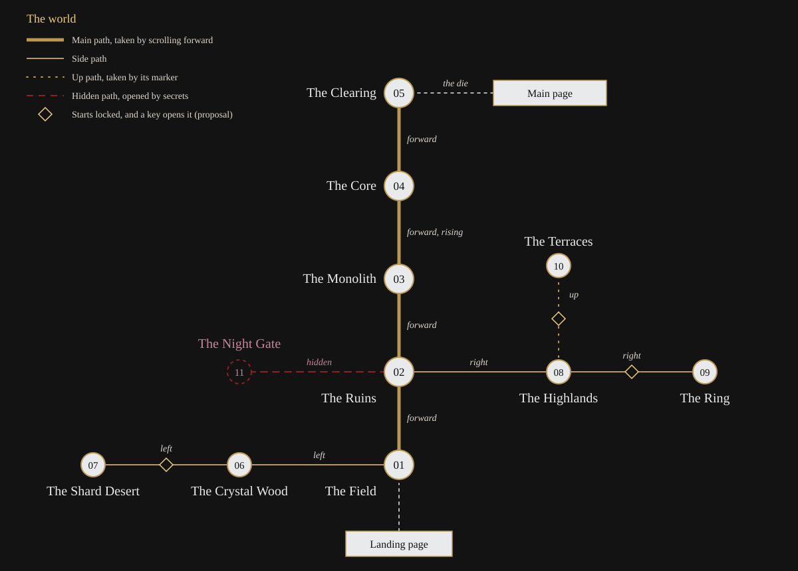

# World map

Status: proposed for Gate 1. The drawing is `docs/world-map.svg`, and `lab/map/` shows it.

## Chapters

Each chapter is one place with a rest point. The ID is used in routes, in `content/world.json` and in Blender names.

| # | Chapter | ID | Route | Rest point in Blender | Build order |
| --- | --- | --- | --- | --- | --- |
| 1 | The Field | `field` | `#/world/field` | `EMPTY_Rest_field` | 1 |
| 2 | The Ruins | `ruins` | `#/world/ruins` | `EMPTY_Rest_ruins` | 2 |
| 3 | The Monolith | `monolith` | `#/world/monolith` | `EMPTY_Rest_monolith` | 3 |
| 4 | The Core | `core` | `#/world/core` | `EMPTY_Rest_core` | 4 |
| 5 | The Clearing | `clearing` | `#/world/clearing` | `EMPTY_Rest_clearing` | 5 |
| 6 | The Crystal Wood | `crystalwood` | `#/world/crystalwood` | `EMPTY_Rest_crystalwood` | 6 |
| 7 | The Shard Desert | `sharddesert` | `#/world/sharddesert` | `EMPTY_Rest_sharddesert` | 9 |
| 8 | The Highlands | `highlands` | `#/world/highlands` | `EMPTY_Rest_highlands` | 7 |
| 9 | The Ring | `ring` | `#/world/ring` | `EMPTY_Rest_ring` | 10 |
| 10 | The Terraces | `terraces` | `#/world/terraces` | `EMPTY_Rest_terraces` | 11 |
| 11 | The Night Gate | `nightgate` | `#/world/nightgate` | `EMPTY_Rest_nightgate` | 8 |

The build order is the one in Section 6.2 of the guide: the main path, then one chapter each way, then the hidden chapter, then the far chapters.

## Paths

A path joins two rest points and has a direction. Each path is one animation clip of `CAM_Journey_Main`.

| Path ID | From | To | Direction | Clip | Main route | Starts |
| --- | --- | --- | --- | --- | --- | --- |
| `field-ruins` | The Field | The Ruins | Forward | `AN_Path_Field_Ruins` | Yes | Open |
| `ruins-monolith` | The Ruins | The Monolith | Forward | `AN_Path_Ruins_Monolith` | Yes | Open |
| `monolith-core` | The Monolith | The Core | Forward, rising through the break | `AN_Path_Monolith_Core` | Yes | Open |
| `core-clearing` | The Core | The Clearing | Forward, down the far side | `AN_Path_Core_Clearing` | Yes | Open |
| `field-crystalwood` | The Field | The Crystal Wood | Left | `AN_Path_Field_CrystalWood` | No | Open (proposal) |
| `crystalwood-sharddesert` | The Crystal Wood | The Shard Desert | Left | `AN_Path_CrystalWood_ShardDesert` | No | Locked (proposal) |
| `ruins-highlands` | The Ruins | The Highlands | Right | `AN_Path_Ruins_Highlands` | No | Open (proposal) |
| `highlands-ring` | The Highlands | The Ring | Right | `AN_Path_Highlands_Ring` | No | Locked (proposal) |
| `highlands-terraces` | The Highlands | The Terraces | Up | `AN_Path_Highlands_Terraces` | No | Locked (proposal) |
| `ruins-nightgate` | The Ruins | The Night Gate | Left (proposal) | `AN_Path_Ruins_NightGate` | No | Hidden |

- A visitor who only scrolls down travels the four main paths from the Field to the Clearing and meets no dead end.
- Every path is travelled back the same way it came.
- The landing page opens onto the Field.
- A small porcelain die in the Clearing leads to the main page.

## What moves the visitor

| Direction | Wheel or trackpad | Touch | Keyboard |
| --- | --- | --- | --- |
| Forward and back | Vertical scroll | Drag up and down | Up and down arrows |
| Left and right | Horizontal scroll, or Shift with the wheel | Drag left and right | Left and right arrows |
| Up and down a level | The marker | The marker | Page Up and Page Down |

At a junction a gilt marker shows each open direction.

## Junctions

| Chapter | Forward | Back | Left | Right | Up |
| --- | --- | --- | --- | --- | --- |
| The Field | The Ruins | The landing page | The Crystal Wood | | |
| The Ruins | The Monolith | The Field | The Night Gate, hidden | The Highlands | |
| The Monolith | The Core | The Ruins | | | |
| The Core | The Clearing | The Monolith | | | |
| The Clearing | The die, to the main page | The Core | | | |
| The Crystal Wood | | | The Shard Desert | The Field | |
| The Shard Desert | | | | The Crystal Wood | |
| The Highlands | | | The Ruins | The Ring | The Terraces |
| The Ring | | | The Highlands | | |
| The Terraces | | | | | Down to the Highlands |
| The Night Gate | | | | The Ruins | |

## Proposals in this map

The guide does not settle these three points. Kiefy rules on them in `docs/gates/gate-1.md`.

| # | Question | Proposal | Reason |
| --- | --- | --- | --- |
| M1 | Where does the hidden path to the Night Gate start? | From the Ruins, to the left | The Night Gate reuses the ruins kit under the night palette, so it sits naturally beside the Ruins. The Ruins are on the main path, so every visitor passes the place where the path will open |
| M2 | Which side paths start locked? | The two near side paths are open. The three far ones open with a key | A visitor who wanders can leave the main path at once, and the far places stay a reward |
| M3 | Is the build order confirmed? | Yes, as in Section 6.2 | It builds the main path first, so the guided way works early |
